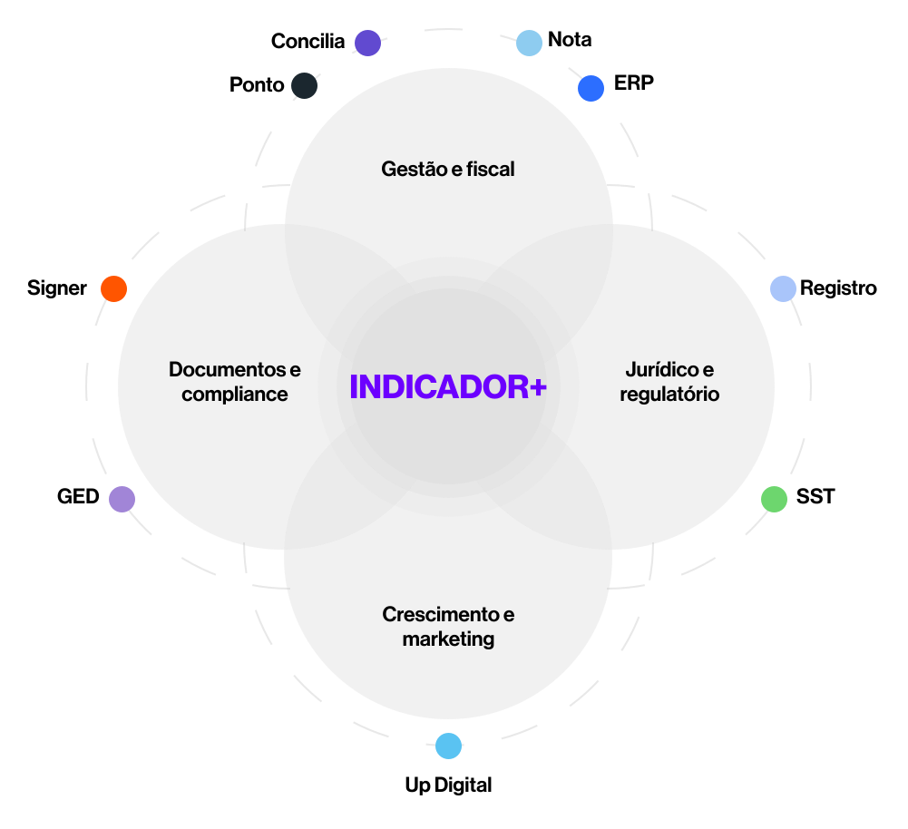

# Diagrama do Ecossistema (SVG animado)

Arquivo: `ecossistema-diagrama.svg`

SVG **autossuficiente** — todas as animações estão embutidas no próprio `<style>` do
arquivo, então funcionam em qualquer landing page, sem precisar de CSS externo.

## Animações incluídas

| Classe          | Efeito                                                        |
|-----------------|--------------------------------------------------------------|
| `.eco-dash`     | Fluxo do tracejado ao redor das 4 elipses (`stroke-dashoffset`) |
| `.eco-diagrama` | Flutuação vertical (`eco-float`) + brilho/pulso (`eco-pulse`) |

Também respeita `prefers-reduced-motion` (desativa as animações para quem prefere menos movimento).

## Como usar

### 1. Inline (recomendado — animações sempre funcionam)
Copie o conteúdo do `.svg` direto no HTML da nova landing page:

```html
<div style="max-width: 880px; margin: 0 auto;">
  <!-- cole aqui o conteúdo de ecossistema-diagrama.svg -->
</div>
```

### 2. Como ``
Também funciona porque as animações estão embutidas:

```html

```

### 3. Como `background-image` (CSS)
```css
.hero-diagrama {
  background: url('ecossistema-diagrama.svg') center / contain no-repeat;
}
```

## Observações

- O `viewBox` tem uma margem extra (`-30 -30 1001 914`) para o brilho e a flutuação
  não serem cortados nas bordas.
- Cores atuais: elipses em cinza (`#E1E1E1`), texto central "INDICADOR+" em roxo (`#6C00FF`).
  Para trocar, edite os atributos `fill` diretamente no arquivo.
